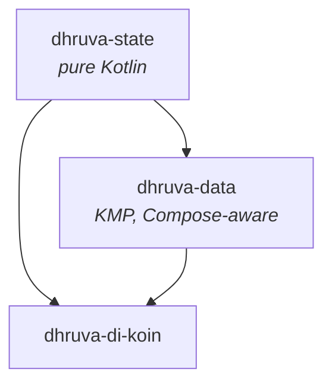

# Architecture

Dhruva is two modules and an optional DI helper. Smaller than that and it'd be a
single class.

## Module map

| Module | What it owns | Required? |
|---|---|---|
| **`state`** | `Location`, `LocationConfig`, `LocationPriority`, `LocationError`, `Logger`. | Yes |
| **`data`** | `LocationTracker` interface and Android / iOS implementations. | Yes |
| **`di-koin`** | Optional Koin module factory. | Optional |

## Platform implementations

### Android

`AndroidLocationTracker` delegates to `FusedLocationProviderClient`. Why fused:

- Battery-efficient out of the box.
- Combines GPS, Wi-Fi, and cellular sources automatically.
- Returns smoothed fixes, fewer outliers than raw `LocationManager`.
- The standard for any Google-Play app.

For one-shot reads, the tracker:

1. Checks the runtime permission. Throws `PermissionDenied` if missing.
2. Checks `LocationManager.isProviderEnabled`. Throws `LocationDisabled` if off.
3. Calls `client.lastLocation.await()`. Returns it if available.
4. Otherwise, registers a one-shot `LocationCallback` and waits up to `timeoutMs`.

For continuous tracking:

1. Same pre-flight checks.
2. Seeds the flow with `lastLocation` (instant UI).
3. Registers a `LocationCallback` with the configured interval and priority.
4. Cleans up on flow cancellation via `awaitClose`.

### iOS

`IosLocationTracker` delegates to `CLLocationManager` directly:

- One-shot reads use `manager.location` (cached) first, then `requestLocation()`
  with a delegate-mediated wait.
- Continuous tracking uses `startUpdatingLocation` / `stopUpdatingLocation`.

`CLLocationManager` is only safe to talk to from the main thread; the tracker
internally marshals there as needed. The delegate uses Kotlin's `callbackFlow` so the
KMP boundary stays Flow-shaped.

## Threading

- All `suspend` functions are safe to call from any dispatcher.
- The Android implementation uses `Looper.getMainLooper()` for `LocationCallback`
  registration as `FusedLocationProviderClient` requires.
- The iOS implementation marshals to the main thread internally where required.

## Crash safety

Every public method either returns a `Location` or throws a typed `LocationError`.
Raw platform exceptions are wrapped in `LocationError.Unknown(cause = ...)`. The
public API has no `Throwable` leaking through.

## What Dhruva does not do (yet)

- **Background location.** Foreground only. Background brings policy and battery
  considerations that warrant a separate, opt-in module.
- **Geofencing.** Planned as `dhruva-geofencing`.
- **Forward / reverse geocoding.** Planned as `dhruva-geocoding`.
- **Map rendering.** Out of scope, pair with [MapLibre Compose](https://github.com/maplibre/maplibre-compose)
  or your map library of choice.
